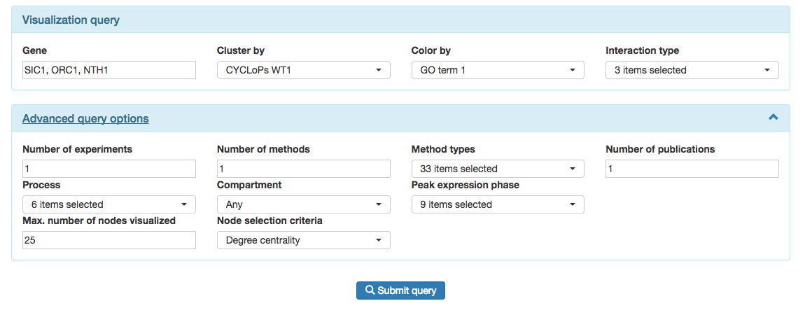

# GEMMER Documentation

## Dependencies
GEMMER would not be possible without the following open-source projects:
* [D3.js](https://d3js.org/)
* [PHP](http://php.net/)
* [APACHE](https://www.apache.org/)
* [SQLite](https://www.sqlite.org/)
* [Python](http://python.org)
    * [Pandas](http://pandas.pydata.org/)
    * [NetworkX](https://networkx.github.io/)
* [Bootstrap](http://getbootstrap.com/)
    * [Bootstrap-select](https://silviomoreto.github.io/bootstrap-select/)
* [jQuery](https://jquery.com/)
    * [DataTables](https://datatables.net/)

## Introduction
GEMMER (**GE**nome-wide software for **M**ulti-scale **M**odeling data **E**xtraction and **R**epresentation) aims to generate publication-quality visualizations of interactions between protein-coding genes in [Saccharomyces cerevisiae](https://en.wikipedia.org/wiki/Saccharomyces_cerevisiae) and serve as a data-integration hub. The visualizations are genome-wide and multi-scale in the sense that the visualizations allow compartment localization, cell cycle expression and functional data to be projected onto the network using data from various other databases. Furthermore, all this data may be inspected online and downloaded at the user's convienence. 

GEMMER aids (modeling) research by providing:
- Effortless data integration from 3 databases
    - SGD (Saccharomyces Genome Database)
    - CYCLoPs (Collection of Yeast Cells Localization Patterns)
    - YeastGFP (Yeast GFP Fusion Localization Database)
-Interaction networks with localization and expression information incorporated 
    - Centered around one or more proteins
- Data visualization using interactive D3 (not 3D!) drawings
    - With various filtering possibilities
- Data export for interaction networks to SVG and Excel

## Data sources
GEMMER bases its visualizations on data from various sources. 
* [SGD]()
* [CYCLoPs]() Specifically, we use the peak cell cycle phase expression data from: M. Rowicka, A. Kudlicki (equal author), B. P. Tu & Z. Otwinowski:  'High-resolution timing of the cell-cycle regulated gene expression', PNAS 104, 16892 (2007).

## The database
### Genome-wide search
Through the [database page](index.php?id=database) users may inspect the data GEMMER collected from other databases on a per protein basis. The entire genome-wide collection of protein-coding genes may be searched through the search form on the database page. 

### Information for a specific gene
On the page for a specific gene, i.e. [SIC1](index.php?id=database&gene=SIC1), users have access to descriptions of the gene (from SGD), GEMMER's functionality predictions based on GO terms from SGD, CYCLoPs expression data if available, GFP database expression data if available and the set of genes it interacts with. The table of interactions allows users to move on to pages specific for the interactors, search the interactors, and links directly to pubmed for publications where the interactions were found. 

## Visualizing a network
The central access hub for the tool is formed by the index.php webpage. 
The form on this page allows user input, e.g. which gene(s) to center the visualization around. 
A simple AJAX script submits the form for processing and displays a brief message to the user. 
Once submitted a PHP processing page makes sure the input is not faulty and if everything checks out executes a python script
'gen_visualization'. Once this script is done it will have generated a JSON file with the necessary information for the visualization.
The user is then automatically forwarded to a new page with a "box" for the visualization with an embedded D3 visualization based on the JSON file. 
This page will also contain download links for an SVG image of the visualization and an Excel file with all the information on the visualized genes and their
interactions. Furthermore various tables with this information are also displayed on the page. 

### The form (basic)

### The form (advanced)

### The visualization page and output

### Exporting the image

### Exporting the data in Excel format

### Visualizing multiple genes together

## Back-end details
### D3js
For drawing the visualization we make use of D3js. 
[d3js](http://d3js.org) is a JavaScript library for manipulating documents based on data.
The library enables stunning client-side visualization inside the webbrowser.
Commonly in science-related websites (and possibly many others), users need to save the generated 
visualization in vectorized format (e.g. PDF), to be able to incorporate the graphics in presentation or publications.

### SGD API Yeastmine

